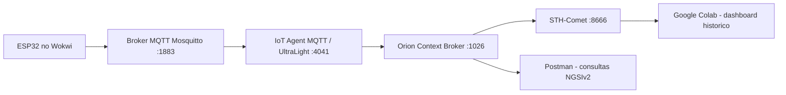

# CarePlus - Sprint 02 - Edge Computing & Computer Systems

Projeto da Sprint 02 do Challenge Care Plus: prototipo IoT de um token/wearable gamificado para acompanhar passos, validar missoes em um totem e enviar telemetria para FIWARE via MQTT.

## Resumo da solucao

O prototipo usa um ESP32 simulado no Wokwi com:

- MPU6050 para detectar movimento/passos.
- Display OLED SSD1306 para feedback ao usuario.
- Botao fisico para validar a missao no totem.
- LEDs vermelho e verde para indicar bloqueio/validacao.
- MQTT para envio em runtime ao FIWARE.
- Orion Context Broker para manter o estado atual.
- STH-Comet para persistir historico.
- Dashboard em Google Colab para consulta e visualizacao dos dados.

## Arquitetura



## Estrutura da pasta

```text
CarePlus_Sprint02_Entrega/
  README.md
  INTEGRANTES.txt
  CHECKLIST_ENTREGA.md
  docs/
    arquitetura.md
    manual_operacao.md
    Challenge Care Plus - Sprints 2 e 3.pdf
  wokwi/
    sketch.ino
    diagram.json
    libraries.txt
    wokwi-project.txt
  postman/
    CarePlus_Sprint02_FIWARE_MQTT_Completo.postman_collection.json
  dashboard_colab/
    careplus_sprint02_colab.py
```

## Configuracao FIWARE

Valores usados no projeto:

| Item | Valor |
|---|---|
| IP da VM | `35.198.7.130` |
| Orion | `http://35.198.7.130:1026` |
| IoT Agent | `http://35.198.7.130:4041` |
| STH-Comet | `http://35.198.7.130:8666` |
| MQTT | `35.198.7.130:1883` |
| FIWARE service | `openiot` |
| FIWARE service path | `/` |
| API key | `TEF` |
| Device ID | `token001` |
| Entity ID | `CarePlusToken:token001` |
| Entity type | `CarePlusToken` |
| Topico MQTT | `/TEF/token001/attrs` |

## Payload UltraLight

O ESP32 publica no topico `/TEF/token001/attrs` com o formato:

```text
s|tracking|p|0|st|12|ps|12|v|0|tp|0|b|99|r|-55|al|moderate|ax|0.21|ay|1.12|az|9.71
```

Mapeamento dos atributos:

| Object ID | Atributo Orion | Descricao |
|---|---|---|
| `s` | `state` | Estado do fluxo |
| `p` | `pressCount` | Quantidade de validacoes |
| `st` | `steps` | Passos totais |
| `ps` | `pendingSteps` | Passos pendentes de validacao |
| `v` | `tokenValue` | Pontos do evento |
| `tp` | `totalPoints` | Pontos acumulados |
| `b` | `batteryLevel` | Nivel de bateria simulado |
| `r` | `rssi` | Sinal Wi-Fi |
| `al` | `activityLevel` | Nivel de atividade |
| `ax` | `accelX` | Aceleracao X |
| `ay` | `accelY` | Aceleracao Y |
| `az` | `accelZ` | Aceleracao Z |

## Como executar

1. Verifique se a VM FIWARE esta ligada e com as portas `1026`, `4041`, `8666` e `1883` acessiveis.
2. Importe a collection `postman/CarePlus_Sprint02_FIWARE_MQTT_Completo.postman_collection.json`.
3. No Postman, rode a pasta `0. Diagnostico da VM`.
4. Rode `2. Setup IoT Agent + Device` para criar o service e o device.
5. Abra o projeto Wokwi da pasta `wokwi/` e execute a simulacao.
6. Confirme no Serial Monitor que o MQTT conectou e publicou telemetria.
7. No Postman, rode `4. Consultas Orion - Estado Atual`.
8. Crie a subscription em `5. STH-Comet - Subscription`.
9. Rode a simulacao por mais tempo e consulte `6. STH-Comet - Historico por atributo`.
10. No Google Colab, cole e execute `dashboard_colab/careplus_sprint02_colab.py`.

## Evidencias esperadas

- Print do Wokwi executando com OLED, botao, LEDs e MPU6050.
- Print do Serial Monitor mostrando MQTT conectado e payload publicado.
- Print do Postman com `Get Entity - keyValues` retornando a entidade.
- Print do STH-Comet retornando historico.
- Print do dashboard Colab com tabela e graficos.
- Link publico da simulacao Wokwi.
- Link publico do video de ate 3 minutos.

## Referencia da stack FIWARE

O fluxo segue a base do material do professor Fabio Cabrini:

https://github.com/fabiocabrini/fiware

## Links da entrega

- Repositorio GitHub: https://github.com/pedrot-git/Sprint02-CarePlus
- Simulacao Wokwi: https://wokwi.com/projects/462573727034430465
- Video: https://youtu.be/xNwy9vlqclw

## Integrantes

- RM567680 - Pedro Henrique Tavares Viana
- RM567855 - David Ernesto Mogollon Gama
- RM566949 - Roger De Carvalho Paiva
