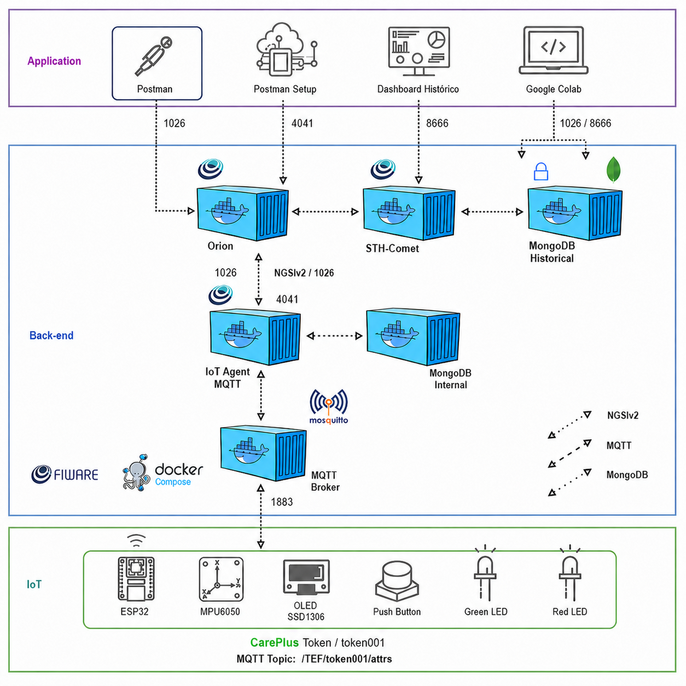

# CarePlus - Sprint 02 - Edge Computing & Computer Systems

Projeto da Sprint 02 do Challenge Care Plus: protótipo IoT de um token/wearable gamificado para acompanhar passos, validar missões em um totem e enviar telemetria para FIWARE via MQTT.

## Resumo da solução

O protótipo usa um ESP32 simulado no Wokwi com:

- MPU6050 para detectar movimento/passos.
- Display OLED SSD1306 para feedback ao usuário.
- Botão físico para validar a missão no totem.
- LEDs vermelho e verde para indicar bloqueio/validação.
- MQTT para envio em runtime ao FIWARE.
- Orion Context Broker para manter o estado atual.
- STH-Comet para persistir histórico.
- Dashboard em Google Colab para consulta e visualização dos dados.

## Arquitetura



O projeto está organizado em três camadas: Edge/IoT, Back-end FIWARE e Application. O ESP32 simulado no Wokwi publica telemetria via MQTT para o broker Mosquitto. O IoT Agent MQTT interpreta o payload UltraLight e atualiza a entidade no Orion Context Broker. O Orion mantém o estado atual e envia notificações para o STH-Comet, que persiste o histórico. O Postman é usado para provisionamento/consultas e o Google Colab para visualização dos dados.

## Estrutura da pasta

```text
CarePlus_Sprint02_Entrega/
  README.md
  INTEGRANTES.txt
  CHECKLIST_ENTREGA.md
  docs/
    arquitetura.png
    arquitetura.md
    manual_operacao.md
    Challenge Care Plus - Sprints 2 e 3.pdf
  wokwi/
    sketch.ino
    diagram.json
    libraries.txt
    wokwi-project.txt
  postman/
    CarePlus_Sprint02_FIWARE_MQTT_Completo.postman_collection.json
  dashboard_colab/
    careplus_sprint02_colab.py
```

## Configuração FIWARE

Valores usados no projeto:

| Item | Valor |
|---|---|
| IP da VM | `00.000.0.000` |
| Orion | `http://00.000.0.000:1026` |
| IoT Agent | `http://00.000.0.000:4041` |
| STH-Comet | `http://00.000.0.000:8666` |
| MQTT | `00.000.0.000:1883` |
| FIWARE service | `openiot` |
| FIWARE service path | `/` |
| API key | `TEF` |
| Device ID | `token001` |
| Entity ID | `CarePlusToken:token001` |
| Entity type | `CarePlusToken` |
| Tópico MQTT | `/TEF/token001/attrs` |

Antes de executar ou demonstrar, substitua `00.000.0.000` pelo IP público da VM FIWARE em três pontos: collection Postman, `wokwi/sketch.ino` e `dashboard_colab/careplus_sprint02_colab.py`.

## Payload UltraLight

O ESP32 publica no tópico `/TEF/token001/attrs` com o formato:

```text
s|tracking|p|0|st|12|ps|12|v|0|tp|0|b|99|r|-55|al|moderate|ax|0.21|ay|1.12|az|9.71
```

Mapeamento dos atributos:

| Object ID | Atributo Orion | Descrição |
|---|---|---|
| `s` | `state` | Estado do fluxo |
| `p` | `pressCount` | Quantidade de validações |
| `st` | `steps` | Passos totais |
| `ps` | `pendingSteps` | Passos pendentes de validação |
| `v` | `tokenValue` | Pontos do evento |
| `tp` | `totalPoints` | Pontos acumulados |
| `b` | `batteryLevel` | Nível de bateria simulado |
| `r` | `rssi` | Sinal Wi-Fi |
| `al` | `activityLevel` | Nível de atividade |
| `ax` | `accelX` | Aceleração X |
| `ay` | `accelY` | Aceleração Y |
| `az` | `accelZ` | Aceleração Z |

## Como executar

### 1. Preparar a VM FIWARE

Recomendado para a VM Linux:

- Ubuntu Server LTS.
- 1 vCPU ou mais.
- 1 GB de RAM ou mais.
- 20 GB de disco ou mais.
- Portas liberadas no firewall/security group: `1026`, `4041`, `8666` e `1883`.

Instale Docker e Docker Compose:

```bash
sudo apt update
sudo apt install docker.io docker-compose -y
sudo systemctl enable docker
sudo systemctl start docker
```

Clone e suba a stack FIWARE usada como base da disciplina:

```bash
git clone https://github.com/fabiocabrini/fiware
cd fiware
sudo docker-compose up -d
```

Confira se os containers estão ativos:

```bash
sudo docker ps
```

### 2. Configurar o IP da VM

Substitua `00.000.0.000` pelo IP público da sua VM nos três arquivos abaixo:

- `postman/CarePlus_Sprint02_FIWARE_MQTT_Completo.postman_collection.json`
- `wokwi/sketch.ino`
- `dashboard_colab/careplus_sprint02_colab.py`

Depois confirme os health checks:

```text
http://00.000.0.000:1026/version
http://00.000.0.000:4041/version
http://00.000.0.000:8666/version
```

Resultado esperado: os três endpoints devem responder `200 OK` ou retornar informações de versão/status dos serviços.

### 3. Provisionar o IoT Agent

1. Importe a collection `postman/CarePlus_Sprint02_FIWARE_MQTT_Completo.postman_collection.json`.
2. No Postman, rode a pasta `0. Diagnostico da VM`.
3. Rode `2. Setup IoT Agent + Device` para criar:
   - IoT Service com `apikey=TEF`.
   - Device mapping `token001`.
   - Mapeamento da entidade `CarePlusToken:token001`.

Resultado esperado: o IoT Agent deve listar o device `token001`. A entidade `CarePlusToken:token001` aparece/atualiza no Orion depois que o ESP32 envia a primeira telemetria MQTT válida.

### 4. Rodar a simulação no Wokwi

1. Abra o projeto Wokwi da pasta `wokwi/`.
2. Confirme no `sketch.ino`:

```cpp
const char* mqttServer = "00.000.0.000";
const int mqttPort = 1883;
const char* mqttTopic = "/TEF/token001/attrs";
```

3. Execute a simulação.
4. No Serial Monitor, confirme:
   - Wi-Fi conectado.
   - MQTT conectado.
   - Payload UltraLight publicado.

Resultado esperado: o Serial Monitor deve mostrar a conexão MQTT e mensagens de telemetria publicadas no tópico `/TEF/token001/attrs`.

### 5. Consultar Orion e STH-Comet

No Postman:

1. Rode `4. Consultas Orion - Estado Atual`.
2. Confirme que `Get Entity - keyValues` retorna `CarePlusToken:token001`.
3. Rode `5. STH-Comet - Subscription` para criar a persistência histórica.
4. Rode o Wokwi por mais tempo.
5. Consulte `6. STH-Comet - Historico por atributo`.

Resultado esperado: o Orion deve retornar atributos como `steps`, `pendingSteps`, `totalPoints`, `batteryLevel`, `accelX`, `accelY` e `accelZ`. Após a subscription, o STH-Comet deve retornar séries históricas dos atributos consultados.

### 6. Executar o dashboard Colab

1. Abra o Google Colab.
2. Cole o conteúdo de `dashboard_colab/careplus_sprint02_colab.py`.
3. Substitua `00.000.0.000` pelo IP público da VM.
4. Execute as células para visualizar estado atual, histórico e gráficos.

Resultado esperado: o notebook deve exibir uma tabela com o estado atual da entidade e gráficos com passos, pontos, bateria e aceleração.

### 7. Encerrar ou resetar a stack

Para encerrar os containers:

```bash
cd fiware
sudo docker-compose down
```

Para reset completo, primeiro confira os nomes dos volumes criados pelo Docker Compose:

```bash
sudo docker volume ls
```

Depois remova os volumes somente se quiser apagar entidades, subscriptions e histórico. Os nomes podem variar conforme o diretório/projeto usado pelo Docker Compose:

```bash
sudo docker volume rm fiware_mongo-historical-data
sudo docker volume rm fiware_mongo-internal-data
```

## Evidências esperadas

- Print do Wokwi executando com OLED, botão, LEDs e MPU6050.
- Print do Serial Monitor mostrando MQTT conectado e payload publicado.
- Print do Postman com `Get Entity - keyValues` retornando a entidade.
- Print do STH-Comet retornando histórico.
- Print do dashboard Colab com tabela e gráficos.
- Link público da simulação Wokwi.
- Link público do vídeo de até 3 minutos.

## Referência da stack FIWARE

O fluxo segue a base do material do professor Fabio Cabrini:

https://github.com/fabiocabrini/fiware

## Links da entrega

- Repositório GitHub: https://github.com/pedrot-git/Sprint02-CarePlus
- Simulação Wokwi: https://wokwi.com/projects/462573727034430465
- Vídeo: https://youtu.be/xNwy9vlqclw

## Integrantes

- RM567680 - Pedro Henrique Tavares Viana
- RM567855 - David Ernesto Mogollon Gama
- RM566949 - Roger De Carvalho Paiva
