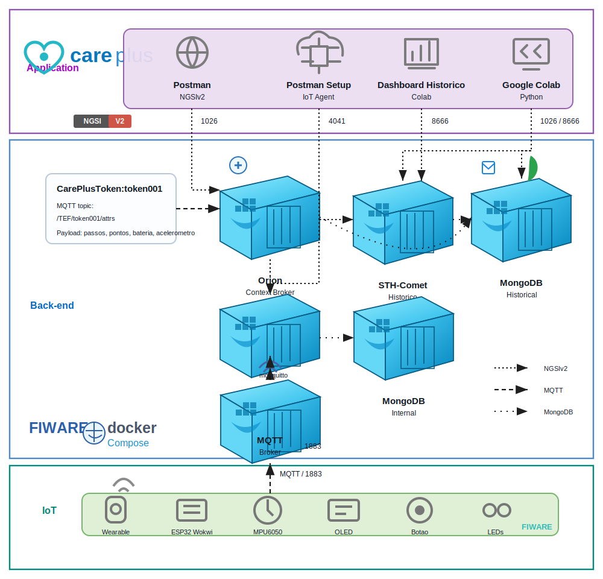
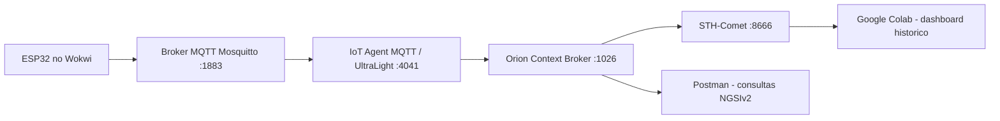

# CarePlus - Sprint 02 - Edge Computing & Computer Systems

Projeto da Sprint 02 do Challenge Care Plus: prototipo IoT de um token/wearable gamificado para acompanhar passos, validar missoes em um totem e enviar telemetria para FIWARE via MQTT.

## Resumo da solucao

O prototipo usa um ESP32 simulado no Wokwi com:

- MPU6050 para detectar movimento/passos.
- Display OLED SSD1306 para feedback ao usuario.
- Botao fisico para validar a missao no totem.
- LEDs vermelho e verde para indicar bloqueio/validacao.
- MQTT para envio em runtime ao FIWARE.
- Orion Context Broker para manter o estado atual.
- STH-Comet para persistir historico.
- Dashboard em Google Colab para consulta e visualizacao dos dados.

## Arquitetura





## Estrutura da pasta

```text
CarePlus_Sprint02_Entrega/
  README.md
  INTEGRANTES.txt
  CHECKLIST_ENTREGA.md
  docs/
    arquitetura-careplus.svg
    arquitetura.md
    manual_operacao.md
    Challenge Care Plus - Sprints 2 e 3.pdf
  wokwi/
    sketch.ino
    diagram.json
    libraries.txt
    wokwi-project.txt
  postman/
    CarePlus_Sprint02_FIWARE_MQTT_Completo.postman_collection.json
  dashboard_colab/
    careplus_sprint02_colab.py
```

## Configuracao FIWARE

Valores usados no projeto:

| Item | Valor |
|---|---|
| IP da VM | `00.000.0.000` |
| Orion | `http://00.000.0.000:1026` |
| IoT Agent | `http://00.000.0.000:4041` |
| STH-Comet | `http://00.000.0.000:8666` |
| MQTT | `00.000.0.000:1883` |
| FIWARE service | `openiot` |
| FIWARE service path | `/` |
| API key | `TEF` |
| Device ID | `token001` |
| Entity ID | `CarePlusToken:token001` |
| Entity type | `CarePlusToken` |
| Topico MQTT | `/TEF/token001/attrs` |

Antes de executar, substitua `00.000.0.000` pelo IP publico da VM FIWARE usada na demonstracao.

## Payload UltraLight

O ESP32 publica no topico `/TEF/token001/attrs` com o formato:

```text
s|tracking|p|0|st|12|ps|12|v|0|tp|0|b|99|r|-55|al|moderate|ax|0.21|ay|1.12|az|9.71
```

Mapeamento dos atributos:

| Object ID | Atributo Orion | Descricao |
|---|---|---|
| `s` | `state` | Estado do fluxo |
| `p` | `pressCount` | Quantidade de validacoes |
| `st` | `steps` | Passos totais |
| `ps` | `pendingSteps` | Passos pendentes de validacao |
| `v` | `tokenValue` | Pontos do evento |
| `tp` | `totalPoints` | Pontos acumulados |
| `b` | `batteryLevel` | Nivel de bateria simulado |
| `r` | `rssi` | Sinal Wi-Fi |
| `al` | `activityLevel` | Nivel de atividade |
| `ax` | `accelX` | Aceleracao X |
| `ay` | `accelY` | Aceleracao Y |
| `az` | `accelZ` | Aceleracao Z |

## Como executar

### 1. Preparar a VM FIWARE

Recomendado para a VM Linux:

- Ubuntu Server LTS.
- 1 vCPU ou mais.
- 1 GB de RAM ou mais.
- 20 GB de disco ou mais.
- Portas liberadas no firewall/security group: `1026`, `4041`, `8666` e `1883`.

Instale Docker e Docker Compose:

```bash
sudo apt update
sudo apt install docker.io docker-compose -y
sudo systemctl enable docker
sudo systemctl start docker
```

Clone e suba a stack FIWARE usada como base da disciplina:

```bash
git clone https://github.com/fabiocabrini/fiware
cd fiware
sudo docker-compose up -d
```

Confira se os containers estao ativos:

```bash
sudo docker ps
```

### 2. Configurar o IP da VM

Substitua `00.000.0.000` pelo IP publico da sua VM nos arquivos:

- `postman/CarePlus_Sprint02_FIWARE_MQTT_Completo.postman_collection.json`
- `wokwi/sketch.ino`
- `dashboard_colab/careplus_sprint02_colab.py`

Depois confirme os health checks:

```text
http://00.000.0.000:1026/version
http://00.000.0.000:4041/version
http://00.000.0.000:8666/version
```

### 3. Provisionar o IoT Agent

1. Importe a collection `postman/CarePlus_Sprint02_FIWARE_MQTT_Completo.postman_collection.json`.
2. No Postman, rode a pasta `0. Diagnostico da VM`.
3. Rode `2. Setup IoT Agent + Device` para criar:
   - IoT Service com `apikey=TEF`.
   - Device `token001`.
   - Entidade `CarePlusToken:token001`.

### 4. Rodar a simulacao no Wokwi

1. Abra o projeto Wokwi da pasta `wokwi/`.
2. Confirme no `sketch.ino`:

```cpp
const char* mqttServer = "00.000.0.000";
const int mqttPort = 1883;
const char* mqttTopic = "/TEF/token001/attrs";
```

3. Execute a simulacao.
4. No Serial Monitor, confirme:
   - Wi-Fi conectado.
   - MQTT conectado.
   - Payload UltraLight publicado.

### 5. Consultar Orion e STH-Comet

No Postman:

1. Rode `4. Consultas Orion - Estado Atual`.
2. Confirme que `Get Entity - keyValues` retorna `CarePlusToken:token001`.
3. Rode `5. STH-Comet - Subscription` para criar a persistencia historica.
4. Rode o Wokwi por mais tempo.
5. Consulte `6. STH-Comet - Historico por atributo`.

### 6. Executar o dashboard Colab

1. Abra o Google Colab.
2. Cole o conteudo de `dashboard_colab/careplus_sprint02_colab.py`.
3. Substitua `00.000.0.000` pelo IP publico da VM.
4. Execute as celulas para visualizar estado atual, historico e graficos.

### 7. Encerrar ou resetar a stack

Para encerrar os containers:

```bash
cd fiware
sudo docker-compose down
```

Para reset completo, apague os volumes apenas se quiser remover entidades, subscriptions e historico:

```bash
sudo docker volume rm fiware_mongo-historical-data
sudo docker volume rm fiware_mongo-internal-data
```

## Evidencias esperadas

- Print do Wokwi executando com OLED, botao, LEDs e MPU6050.
- Print do Serial Monitor mostrando MQTT conectado e payload publicado.
- Print do Postman com `Get Entity - keyValues` retornando a entidade.
- Print do STH-Comet retornando historico.
- Print do dashboard Colab com tabela e graficos.
- Link publico da simulacao Wokwi.
- Link publico do video de ate 3 minutos.

## Referencia da stack FIWARE

O fluxo segue a base do material do professor Fabio Cabrini:

https://github.com/fabiocabrini/fiware

## Links da entrega

- Repositorio GitHub: https://github.com/pedrot-git/Sprint02-CarePlus
- Simulacao Wokwi: https://wokwi.com/projects/462573727034430465
- Video: https://youtu.be/xNwy9vlqclw

## Integrantes

- RM567680 - Pedro Henrique Tavares Viana
- RM567855 - David Ernesto Mogollon Gama
- RM566949 - Roger De Carvalho Paiva

