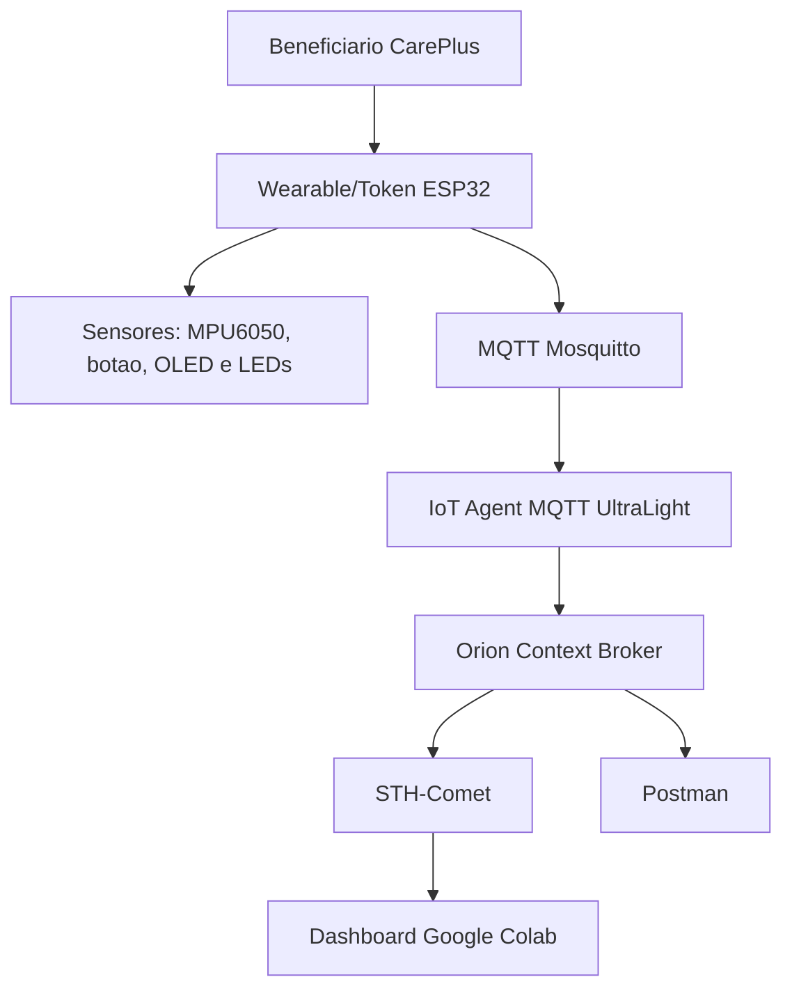

# Arquitetura da Solucao

## Camadas

### Edge

O ESP32 simulado no Wokwi representa o dispositivo de borda da solucao. Ele coleta sinais do MPU6050, contabiliza passos, exibe feedback no OLED e permite validacao por botao no totem.

### MQTT

O ESP32 se conecta ao broker Mosquitto na porta `1883` e publica mensagens UltraLight no topico `/TEF/token001/attrs`.

### Back-end IoT/FIWARE

O IoT Agent MQTT recebe a telemetria, interpreta os object IDs UltraLight e cria/atualiza a entidade `CarePlusToken:token001` no Orion Context Broker.

### Persistencia

O Orion envia notificacoes para o STH-Comet por meio de uma subscription. O STH-Comet armazena o historico por atributo.

### Aplicacao/Dashboard

O Postman e usado para provisionamento, diagnostico e consulta. O Google Colab consulta Orion/STH-Comet e gera tabelas e graficos de acompanhamento.

## Diagrama

## Dados da entidade

Entidade principal: `CarePlusToken:token001`

Tipo: `CarePlusToken`

Atributos principais: `steps`, `pendingSteps`, `tokenValue`, `totalPoints`, `batteryLevel`, `activityLevel`, `accelX`, `accelY`, `accelZ`.

